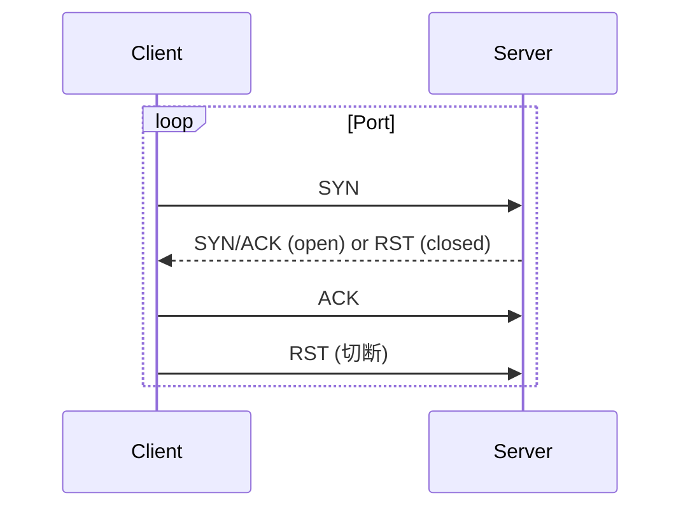
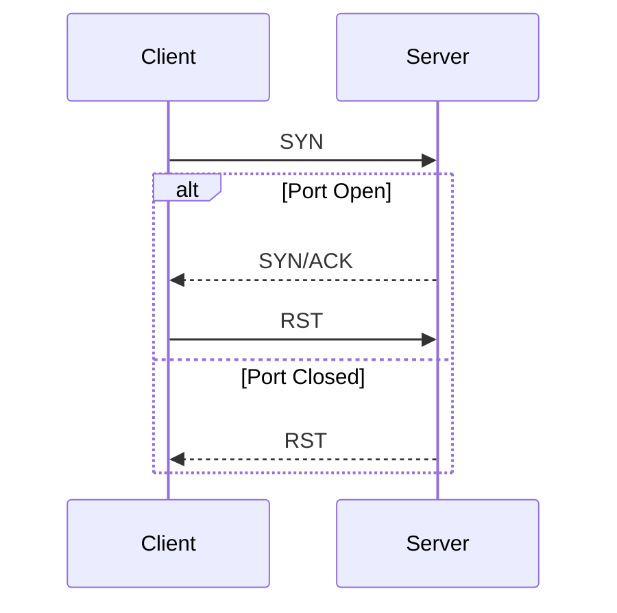
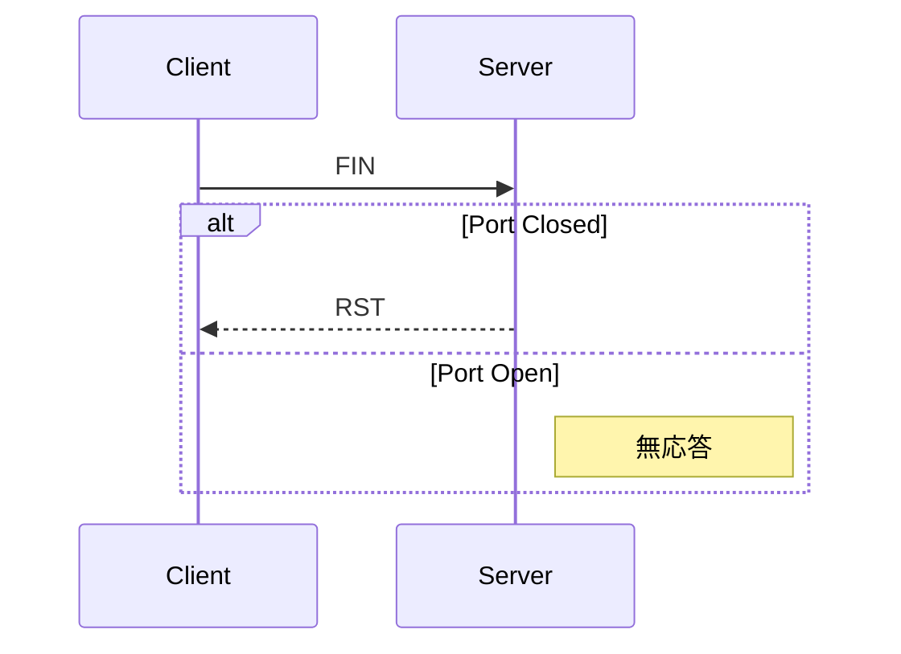

# NeLST 設計書

ネットワークの負荷テストとセキュリティテストを行うCLIツールの設計ドキュメント。

---

## 1. コマンド体系

```
nelst <COMMAND> [OPTIONS]

COMMANDS:
    load        負荷テスト（トラフィック/コネクション/HTTP）
    scan        セキュリティスキャン（ポート/SSL/TLS）
    diag        ネットワーク診断（ping/traceroute/DNS）
    bench       帯域幅・レイテンシ測定
    server      テスト用サーバ起動
    report      テスト結果のレポート生成
    profile     プロファイル管理
    help        ヘルプ表示

GLOBAL OPTIONS:
    --config <FILE>         設定ファイル指定
    --profile <NAME>        プロファイル使用
    --save-profile <NAME>   現在の設定をプロファイルとして保存
    --format <FORMAT>       出力形式 [json|csv|html|markdown|text]
    --report <FILE>         結果をファイルに保存
    --quiet                 出力を最小限に
    --json                  JSON形式で出力
```

---

## 2. 負荷テスト (`load`)

### 2.1 概要

```bash
nelst load <SUBCOMMAND> [OPTIONS]

SUBCOMMANDS:
    traffic     データ送受信の負荷テスト
    connection  大量コネクション確立テスト
    http        HTTP/HTTPS負荷テスト
```

### 2.2 共通オプション

| オプション | 短縮 | 説明 | デフォルト |
|-----------|------|------|-----------|
| `--target <HOST:PORT>` | `-t` | ターゲットアドレス | (必須) |
| `--protocol <tcp\|udp>` | `-p` | プロトコル | tcp |
| `--duration <SECONDS>` | `-d` | テスト継続時間 | 60 |
| `--concurrency <NUM>` | `-c` | 同時接続数 | 1 |
| `--rate <NUM>` | `-r` | 毎秒リクエスト数 | unlimited |
| `--output <FILE>` | `-o` | 結果出力ファイル | - |
| `--verbose` | `-v` | 詳細ログ出力 | false |

### 2.3 トラフィック負荷テスト (`load traffic`)

ターゲットへ指定したデータサイズのパケットを送信し続ける。

```bash
nelst load traffic [OPTIONS]

OPTIONS:
    -s, --size <BYTES>           パケットサイズ [default: 1024]
    -m, --mode <send|echo|recv>  動作モード
                                   send: 送信のみ
                                   echo: エコーサーバへ送受信
                                   recv: 受信のみ（サーバモード）
    --payload <FILE|STRING>      カスタムペイロード
```

#### 使用例

```bash
# TCPでエコーサーバへ10秒間負荷テスト
nelst load traffic -t 192.168.1.100:8080 -d 10 -s 4096 -m echo

# UDPで100並列、送信のみ
nelst load traffic -t 192.168.1.100:5000 -p udp -c 100 -m send
```

### 2.4 コネクション負荷テスト (`load connection`)

大量のTCPコネクションを確立し、サーバのコネクション処理能力をテストする。

```bash
nelst load connection [OPTIONS]

OPTIONS:
    -n, --count <NUM>            確立するコネクション総数 [default: 1000]
    --keep-alive                 コネクションを維持する
    --timeout <MS>               コネクションタイムアウト [default: 5000]
```

#### 使用例

```bash
# 10000コネクションを確立（C10K問題テスト）
nelst load connection -t 192.168.1.100:8080 -n 10000 -c 100

# コネクション維持テスト
nelst load connection -t 192.168.1.100:8080 -n 5000 --keep-alive
```

### 2.5 HTTP負荷テスト (`load http`)

HTTP/HTTPSエンドポイントに対する負荷テスト。REST APIテストに最適。

```bash
nelst load http [OPTIONS]

OPTIONS:
    -u, --url <URL>              ターゲットURL (必須)
    -X, --method <METHOD>        HTTPメソッド [default: GET]
    -H, --header <KEY:VALUE>     カスタムヘッダー（複数指定可）
    -b, --body <DATA|@FILE>      リクエストボディ
    --follow-redirects           リダイレクトを追跡
    --insecure                   SSL証明書検証をスキップ
    --http2                      HTTP/2を優先使用
    --timeout <MS>               リクエストタイムアウト [default: 30000]
```

#### 使用例

```bash
# GETリクエストで負荷テスト
nelst load http -u https://api.example.com/users -c 50 -d 30

# POSTリクエスト（JSONボディ）
nelst load http -u https://api.example.com/users \
    -X POST \
    -H "Content-Type: application/json" \
    -b '{"name": "test"}' \
    -c 20 -d 60

# 認証ヘッダー付き
nelst load http -u https://api.example.com/protected \
    -H "Authorization: Bearer token123" \
    -c 10

# ファイルからリクエストボディを読み込み
nelst load http -u https://api.example.com/data -X POST -b @request.json

# レート制限付き（100 req/s）、結果をファイルに保存
nelst load http -u https://api.example.com -r 100 -o result.json

# HTTP/2を優先使用
nelst load http -u https://example.com --http2
```

### 2.6 バッチモード

複数ターゲットへの一括テスト実行。

```bash
nelst load traffic --batch <TARGETS_FILE> [OPTIONS]
```

**targets.txt の形式:**
```
192.168.1.100:8080
192.168.1.101:8080
192.168.1.102:9000
```

---

## 3. セキュリティスキャン (`scan`)

### 3.1 概要

```bash
nelst scan <SUBCOMMAND> [OPTIONS]

SUBCOMMANDS:
    port        ポートスキャン
    ssl         SSL/TLS検査
    service     サービス検出・バナー取得
```

### 3.2 共通オプション

| オプション | 短縮 | 説明 | デフォルト |
|-----------|------|------|-----------|
| `--target <HOST>` | `-t` | ターゲットホスト | (必須) |
| `--ports <RANGE>` | - | ポート範囲 | 1-1024 |
| `--concurrency <NUM>` | `-c` | 並列スキャン数 | 100 |
| `--timeout <MS>` | - | タイムアウト | 1000 |
| `--output <FILE>` | `-o` | 結果出力ファイル | - |

### 3.3 ポートスキャン (`scan port`)

```bash
nelst scan port [OPTIONS]

OPTIONS:
    -m, --method <METHOD>        スキャン手法
                                   tcp:  TCP Connect スキャン (default)
                                   syn:  SYN スキャン (要root)
                                   fin:  FIN スキャン (要root)
                                   xmas: Xmas スキャン (要root)
                                   null: NULL スキャン (要root)
                                   udp:  UDP スキャン
    --top-ports <NUM>            よく使われるポート上位N件のみ
    --service-detection          サービス検出を有効化
```

#### 使用例

```bash
# TCPコネクトスキャン（全ポート）
nelst scan port -t 192.168.1.100 --ports 1-65535

# SYNスキャン（ステルス）
sudo nelst scan port -t 192.168.1.100 -m syn --top-ports 1000

# UDP + サービス検出
nelst scan port -t 192.168.1.100 -m udp --service-detection
```

### 3.4 スキャン手法詳細

#### TCP Connect スキャン
通常のTCP 3ウェイハンドシェイクを完了させる。
root権限不要だが、ログに残りやすい。



#### SYN スキャン (Half-open)
SYNパケットのみ送信し、SYN/ACKを受信したらRSTで切断。
コネクションを完了しないためステルス性が高い。



#### FIN スキャン
FINパケットを送信。クローズドポートはRSTを返し、オープンポートは無応答。



#### Xmas スキャン
FIN + URG + PSH フラグを設定したパケットを送信。

#### NULL スキャン
フラグなしのパケットを送信。

#### UDP スキャン
UDPパケットを送信し、ICMP Port Unreachableの有無で判定。

### 3.5 SSL/TLS検査 (`scan ssl`)

SSL/TLS設定のセキュリティを検査する。

```bash
nelst scan ssl [OPTIONS]

OPTIONS:
    -t, --target <HOST:PORT>     ターゲット (必須)
    --check-cert                 証明書の有効性を検証
    --check-chain                証明書チェーンを検証
    --check-ciphers              暗号スイートを検査
    --check-protocols            対応プロトコルを検査
    --check-vulnerabilities      既知の脆弱性をチェック (POODLE, BEAST, etc.)
    --all                        すべての検査を実行
```

#### 使用例

```bash
# 総合SSL検査
nelst scan ssl -t example.com:443 --all

# 証明書のみ検証
nelst scan ssl -t example.com:443 --check-cert --check-chain
```

#### 出力例

```
NeLST - SSL/TLS Scanner
━━━━━━━━━━━━━━━━━━━━━━━━━━━━━━━━━━━━━━━━━━━━━━━━━━━━━━━━━

Target: example.com:443

━━━━━━━━━━━ CERTIFICATE ━━━━━━━━━━━━━━━━━━━━━━━━━━━━━━━

  Subject:      CN=example.com
  Issuer:       Let's Encrypt Authority X3
  Valid From:   2025-01-01
  Valid Until:  2025-03-31
  Days Left:    109 ✓
  
  Signature:    SHA256withRSA ✓
  Key Size:     2048 bit ✓

━━━━━━━━━━━ PROTOCOLS ━━━━━━━━━━━━━━━━━━━━━━━━━━━━━━━━━

  TLS 1.3    ✓ Supported
  TLS 1.2    ✓ Supported
  TLS 1.1    ✗ Disabled (Good)
  TLS 1.0    ✗ Disabled (Good)
  SSLv3      ✗ Disabled (Good)

━━━━━━━━━━━ VULNERABILITIES ━━━━━━━━━━━━━━━━━━━━━━━━━━━

  Heartbleed    ✓ Not Vulnerable
  POODLE        ✓ Not Vulnerable
  BEAST         ✓ Not Vulnerable
  CRIME         ✓ Not Vulnerable

Grade: A
```

### 3.6 サービス検出 (`scan service`)

オープンポートで動作しているサービスを特定する。

```bash
nelst scan service [OPTIONS]

OPTIONS:
    -t, --target <HOST>          ターゲットホスト (必須)
    --ports <RANGE>              対象ポート [default: detected open ports]
    --grab-banner                バナー取得を有効化
    --version-detection          バージョン検出を試行
    --aggressive                 より詳細な検出（時間がかかる）
```

#### 使用例

```bash
# バナー取得
nelst scan service -t 192.168.1.100 --ports 22,80,443 --grab-banner

# バージョン検出付き
nelst scan service -t 192.168.1.100 --version-detection
```

#### 出力例

```
NeLST - Service Detection
━━━━━━━━━━━━━━━━━━━━━━━━━━━━━━━━━━━━━━━━━━━━━━━━━━━━━━━━━

Target: 192.168.1.100

  PORT      SERVICE    VERSION                    BANNER
  22/tcp    ssh        OpenSSH 8.9p1              SSH-2.0-OpenSSH_8.9p1
  80/tcp    http       nginx 1.24.0               Server: nginx/1.24.0
  443/tcp   https      nginx 1.24.0               -
  3306/tcp  mysql      MySQL 8.0.35               5.7.42-MySQL Community
```

### 3.7 スキャン結果の比較（diff）

前回のスキャン結果と比較して変化を検出する。

```bash
nelst scan port -t 192.168.1.100 --diff <PREVIOUS_RESULT>
```

#### 出力例

```
━━━━━━━━━━━ CHANGES DETECTED ━━━━━━━━━━━━━━━━━━━━━━━━━

  [+] 8080/tcp    OPENED    (was: closed)
  [-] 21/tcp     CLOSED    (was: open)
  [~] 22/tcp     ssh → dropbear (service changed)
```

---

## 4. ネットワーク診断 (`diag`)

基本的なネットワーク診断機能を提供。

```bash
nelst diag <SUBCOMMAND> [OPTIONS]

SUBCOMMANDS:
    ping        ICMP/TCP pingテスト
    trace       経路追跡（traceroute）
    dns         DNS解決テスト
    mtu         MTU探索
```

### 4.1 Ping (`diag ping`)

```bash
nelst diag ping [OPTIONS]

OPTIONS:
    -t, --target <HOST>          ターゲット (必須)
    -c, --count <NUM>            送信回数 [default: 4]
    -i, --interval <MS>          送信間隔 [default: 1000]
    --tcp                        TCP pingを使用（ICMP不可時）
    --port <PORT>                TCPポート（--tcp使用時）[default: 80]
```

#### 使用例

```bash
# 通常のping
nelst diag ping -t 192.168.1.1 -c 10

# TCP ping（ファイアウォール越し）
nelst diag ping -t example.com --tcp --port 443
```

### 4.2 Traceroute (`diag trace`)

```bash
nelst diag trace [OPTIONS]

OPTIONS:
    -t, --target <HOST>          ターゲット (必須)
    --max-hops <NUM>             最大ホップ数 [default: 30]
    --tcp                        TCPを使用
    --udp                        UDPを使用（デフォルト）
    --icmp                       ICMPを使用
```

### 4.3 DNS解決 (`diag dns`)

```bash
nelst diag dns [OPTIONS]

OPTIONS:
    -t, --target <DOMAIN>        対象ドメイン (必須)
    --record-type <TYPE>         レコードタイプ [a|aaaa|mx|txt|ns|cname|soa|ptr|all]
    -s, --server <IP>            DNSサーバ指定
    --tcp                        TCP経由で問い合わせ
    --timeout <MS>               タイムアウト [default: 5000]
```

#### 使用例

```bash
# Aレコードを検索
nelst diag dns -t google.com

# MXレコードを検索
nelst diag dns -t google.com --record-type mx

# すべてのレコードを取得
nelst diag dns -t google.com --record-type all

# 特定のDNSサーバを使用
nelst diag dns -t google.com -s 8.8.8.8
```

### 4.4 MTU探索 (`diag mtu`)

```bash
nelst diag mtu [OPTIONS]

OPTIONS:
    -t, --target <HOST>          ターゲット (必須)
    --min-mtu <BYTES>            最小MTU [default: 576]
    --max-mtu <BYTES>            最大MTU [default: 1500]
    --timeout <MS>               タイムアウト [default: 1000]
```

#### 使用例

```bash
# Path MTU探索
sudo nelst diag mtu -t google.com

# 探索範囲を指定
sudo nelst diag mtu -t 192.168.1.1 --min-mtu 576 --max-mtu 9000
```

---

## 5. 帯域幅測定 (`bench`)

ネットワーク帯域幅とレイテンシを測定。

```bash
nelst bench <SUBCOMMAND> [OPTIONS]

SUBCOMMANDS:
    bandwidth   帯域幅測定
    latency     レイテンシ測定
```

### 5.1 帯域幅測定 (`bench bandwidth`)

```bash
nelst bench bandwidth [OPTIONS]

OPTIONS:
    -t, --target <HOST:PORT>     ターゲット（サーバモード起動が必要）
    -d, --duration <SECONDS>     測定時間 [default: 10]
    --direction <up|down|both>   測定方向 [default: both]
    -p, --parallel <NUM>         並列ストリーム数 [default: 1]
```

#### 使用例

```bash
# サーバ側
nelst bench bandwidth --server -b 0.0.0.0:5201

# クライアント側
nelst bench bandwidth -t 192.168.1.100:5201 -d 30 --direction both
```

#### 出力例

```
NeLST - Bandwidth Test
━━━━━━━━━━━━━━━━━━━━━━━━━━━━━━━━━━━━━━━━━━━━━━━━━━━━━━━━━

Connecting to 192.168.1.100:5201...
Duration: 10s

━━━━━━━━━━━ UPLOAD ━━━━━━━━━━━━━━━━━━━━━━━━━━━━━━━━━━━━━

  [========================================] 100%
  
  Average:    942.5 Mbps
  Peak:       987.2 Mbps
  Jitter:     2.3 ms

━━━━━━━━━━━ DOWNLOAD ━━━━━━━━━━━━━━━━━━━━━━━━━━━━━━━━━━━

  [========================================] 100%
  
  Average:    956.8 Mbps
  Peak:       991.4 Mbps
  Jitter:     1.8 ms
```

### 5.2 レイテンシ測定 (`bench latency`)

継続的なレイテンシ監視。

```bash
nelst bench latency [OPTIONS]

OPTIONS:
    -t, --target <HOST:PORT>     ターゲット (必須)
    -c, --count <NUM>            測定回数 [default: 100]
    -d, --duration <SECONDS>     測定時間 [default: 60]
    -i, --interval <MS>          測定間隔 [default: 100]
    --histogram                  ヒストグラム表示
    --server                     サーバモードで起動
    -b, --bind <HOST:PORT>       バインドアドレス [default: 0.0.0.0:5201]
```

#### 使用例

```bash
# サーバ側
nelst bench latency --server -b 0.0.0.0:5201

# クライアント側（100回測定）
nelst bench latency -t 192.168.1.100:5201 -c 100

# ヒストグラム付きで測定
nelst bench latency -t 192.168.1.100:5201 -d 30 --histogram
```

---

## 6. サーバモード (`server`)

負荷テストのターゲットとして使用するサーバを起動する。

```bash
nelst server <SUBCOMMAND> [OPTIONS]

SUBCOMMANDS:
    echo        エコーサーバ（受信データをそのまま返す）
    sink        シンクサーバ（受信のみ、応答なし）
    flood       フラッドサーバ（指定サイズのデータを送り続ける）
    http        HTTPテストサーバ

OPTIONS (echo/sink/flood):
    -b, --bind <HOST:PORT>       バインドアドレス [default: 0.0.0.0:8080]
    -p, --protocol <tcp|udp>     プロトコル [default: tcp]
    -s, --size <BYTES>           応答サイズ (floodで使用)

OPTIONS (http):
    -b, --bind <HOST:PORT>       バインドアドレス [default: 0.0.0.0:8080]
    --body <STRING>              レスポンスボディ [default: OK]
    --status <CODE>              レスポンスステータスコード [default: 200]
    --delay <MS>                 レスポンス遅延（ミリ秒） [default: 0]
    --error-rate <0.0-1.0>       エラー率（5xxを返す確率） [default: 0]
```

#### 使用例

```bash
# エコーサーバ起動
nelst server echo -b 0.0.0.0:8080

# UDPエコーサーバ
nelst server echo -b 0.0.0.0:8080 -p udp

# UDPシンクサーバ
nelst server sink -b 0.0.0.0:5000 -p udp

# フラッドサーバ（4KBデータを送信）
nelst server flood -b 0.0.0.0:8080 -s 4096

# HTTPテストサーバ
nelst server http -b 0.0.0.0:8080

# 遅延シミュレーション付きHTTPサーバ（100ms遅延）
nelst server http -b 0.0.0.0:8080 --delay 100

# 10%エラー率のHTTPサーバ（エラーハンドリングテスト用）
nelst server http -b 0.0.0.0:8080 --error-rate 0.1

# 帯域幅測定サーバ
nelst server bandwidth -b 0.0.0.0:5201
```

---

## 7. レポート (`report`)

テスト結果を各種フォーマットで出力する。

```bash
nelst report <INPUT_FILE> [OPTIONS]

OPTIONS:
    -f, --format <FORMAT>        出力形式 [json|csv|html|text]
    -o, --output <FILE>          出力ファイル
    --compare <FILE>             別結果ファイルと比較
```

---

## 8. 出力例

### 負荷テスト結果

```
NeLST - Network Load Test
━━━━━━━━━━━━━━━━━━━━━━━━━━━━━━━━━━━━━━━━━━━━━━━━━━━━━━━━━

Target:       192.168.1.100:8080
Protocol:     TCP
Mode:         Echo
Duration:     10s
Concurrency:  10
Packet Size:  1024 bytes

Running... ████████████████████████████████████████ 100% [10s/10s]

━━━━━━━━━━━━━━━━━ RESULTS ━━━━━━━━━━━━━━━━━━━━━━━━━━━━━━

  Total Requests:     125,432
  Successful:         125,430 (99.99%)
  Failed:             2 (0.01%)
  
  Throughput:         12,543 req/s
  Data Transferred:   122.5 MB
  
  Latency:
    Min:    0.5 ms
    Max:    45.2 ms
    Avg:    2.3 ms
    P50:    1.8 ms
    P95:    8.5 ms
    P99:    25.1 ms
```

### ポートスキャン結果

```
NeLST - Port Scanner
━━━━━━━━━━━━━━━━━━━━━━━━━━━━━━━━━━━━━━━━━━━━━━━━━━━━━━━━━

Target: 192.168.1.100
Method: SYN Scan
Ports:  Top 100

Scanning... ████████████████████████████████████████ 100%

━━━━━━━━━━━━━━━━━ OPEN PORTS ━━━━━━━━━━━━━━━━━━━━━━━━━━━

  PORT      STATE    SERVICE
  22/tcp    open     ssh
  80/tcp    open     http
  443/tcp   open     https
  3306/tcp  open     mysql

Scan completed in 2.3s
```

---

## 9. プロファイル管理 (`profile`)

よく使う設定を保存・管理する。

```bash
nelst profile <SUBCOMMAND>

SUBCOMMANDS:
    save <NAME>     現在のオプションをプロファイルとして保存
    list            保存済みプロファイル一覧
    show <NAME>     プロファイル内容を表示
    delete <NAME>   プロファイルを削除
    export <NAME>   プロファイルをファイルにエクスポート
    import <FILE>   ファイルからプロファイルをインポート
```

#### 使用例

```bash
# プロファイル保存
nelst load traffic -t 192.168.1.100:8080 -c 50 -d 60 --save-profile prod-load-test

# プロファイル使用
nelst load traffic --profile prod-load-test

# プロファイル一覧
nelst profile list

# プロファイルエクスポート（チーム共有用）
nelst profile export prod-load-test > prod-load-test.toml
```

#### プロファイル保存先

```
~/.nelst/profiles/
├── prod-load-test.toml
├── staging-scan.toml
└── local-dev.toml
```

---

## 10. 技術設計

### 10.1 使用クレート

| クレート | 用途 |
|---------|------|
| `clap` | CLI引数パーサー（サブコマンド対応） |
| `tokio` | 非同期ランタイム |
| `mio` | 低レベルI/O（継続使用） |
| `pnet` | Raw socketパケット操作 |
| `socket2` | ソケットオプション制御 |
| `rustls` / `native-tls` | SSL/TLS処理 |
| `trust-dns-resolver` | DNS解決 |
| `reqwest` | HTTP/HTTPSクライアント |
| `hyper` | HTTPサーバ |
| `indicatif` | プログレスバー表示 |
| `serde` / `serde_json` | シリアライズ/JSON出力 |
| `log` / `tracing` | ロギング・トレーシング |
| `chrono` | タイムスタンプ |
| `dirs` | プロファイル保存先 |

### 10.2 モジュール構成

```
src/
├── main.rs              # エントリポイント、CLI定義
├── cli/
│   ├── mod.rs           # CLIパーサー
│   ├── load.rs          # loadサブコマンド
│   ├── scan.rs          # scanサブコマンド
│   ├── diag.rs          # diagサブコマンド
│   ├── bench.rs         # benchサブコマンド
│   ├── server.rs        # serverサブコマンド
│   └── profile.rs       # profileサブコマンド
├── load/
│   ├── mod.rs
│   ├── traffic.rs       # トラフィック負荷テスト
│   ├── connection.rs    # コネクション負荷テスト
│   └── http.rs          # HTTP負荷テスト
├── scan/
│   ├── mod.rs
│   ├── tcp_connect.rs   # TCP Connectスキャン
│   ├── syn.rs           # SYNスキャン
│   ├── fin.rs           # FINスキャン
│   ├── xmas.rs          # Xmasスキャン
│   ├── null.rs          # NULLスキャン
│   ├── udp.rs           # UDPスキャン
│   ├── ssl.rs           # SSL/TLS検査
│   └── service.rs       # サービス検出
├── diag/
│   ├── mod.rs
│   ├── ping.rs          # Ping
│   ├── trace.rs         # Traceroute
│   ├── dns.rs           # DNS解決
│   └── mtu.rs           # MTU探索
├── bench/
│   ├── mod.rs
│   ├── bandwidth.rs     # 帯域幅測定
│   └── latency.rs       # レイテンシ測定
├── server/
│   ├── mod.rs
│   ├── echo.rs          # エコーサーバ
│   ├── sink.rs          # シンクサーバ
│   ├── flood.rs         # フラッドサーバ
│   ├── http.rs          # HTTPサーバ
│   └── bandwidth.rs     # 帯域幅測定サーバ
├── report/
│   ├── mod.rs
│   ├── formatter.rs     # 出力フォーマッタ
│   └── diff.rs          # 差分比較
├── profile/
│   ├── mod.rs
│   └── manager.rs       # プロファイル管理
└── common/
    ├── mod.rs
    ├── stats.rs         # 統計収集
    ├── config.rs        # 設定管理
    └── output.rs        # 出力ユーティリティ
```

### 10.3 設計方針

- **CLI優先**: 設定ファイルよりCLI引数を優先。`--config` で設定ファイル指定も可能
- **非同期処理**: `tokio` ベースの非同期I/O
- **プログレス表示**: リアルタイムで進捗を可視化
- **構造化出力**: JSON形式で機械処理可能な出力をサポート

---

## 11. 設定ファイル

`~/.nelst/config.toml` または `./nelst.toml` でデフォルト値を設定可能。
CLI引数は設定ファイルより優先される。

```toml
[defaults]
verbose = false
timeout = 5000

[load]
protocol = "tcp"
concurrency = 10
duration = 60
size = 1024

[scan]
method = "tcp"
ports = "1-1024"
concurrency = 100
timeout = 1000

[server]
bind = "0.0.0.0:8080"
protocol = "tcp"
```

---

## 12. エラーハンドリング

### 終了コード

| コード | 説明 |
|-------|------|
| 0 | 正常終了 |
| 1 | 一般的なエラー |
| 2 | 引数エラー |
| 3 | 接続エラー |
| 4 | 権限エラー（要root） |
| 5 | タイムアウト |

### エラーメッセージ例

```
Error: Permission denied. SYN scan requires root privileges.
Hint: Run with 'sudo nelst scan port -m syn ...'

Error: Connection refused to 192.168.1.100:8080
Hint: Verify the target is running and accessible.
```

---

## 13. 注意事項

### 法的注意

⚠️ **重要**: ポートスキャンや負荷テストは、**許可されたシステムに対してのみ**実行してください。

- 無許可でのスキャンは不正アクセス禁止法等に抵触する可能性があります
- 本番環境への負荷テストは事前に関係者と調整してください
- テスト実行前に対象システムの管理者から書面での許可を取得することを推奨します

### 技術的注意

- SYN/FIN/Xmas/NULL/UDPスキャンには **root権限** が必要です
- 一部のファイアウォールやIDS/IPSはスキャンを検知・ブロックする場合があります
- 負荷テストは対象システムおよびネットワーク経路に影響を与える可能性があります
- クラウド環境では、プロバイダのペネトレーションテストポリシーを確認してください

---

## 14. 実装状況（v0.5.0現在）

本設計書は最終目標を示しています。現在の実装状況については [PLAN.md](PLAN.md) を参照してください。

### 実装済み（Phase 0-5）

| 機能カテゴリ | 状態 | 備考 |
|-------------|------|------|
| CLI基盤 | ✅ 完了 | clap derive マクロ |
| 負荷テスト（traffic/connection） | ✅ 完了 | TCP/UDP対応 |
| HTTP負荷テスト | ✅ 完了 | GET/POST/PUT/DELETE, HTTP/2 |
| テストサーバ | ✅ 完了 | echo/sink/flood/http |
| ポートスキャン | ✅ 完了 | tcp/syn/fin/xmas/null/udp |
| サービス検出 | ✅ 完了 | `--grab-banner`, `--service-detection` |
| SSL/TLS検査 | ✅ 完了 | `--ssl-check` オプション |
| 統計・出力 | ✅ 完了 | JSON出力、ファイル出力 |
| Ping | ✅ 完了 | ICMP/TCP ping、統計表示 |
| Traceroute | ✅ 完了 | UDP/TCP/ICMPモード |
| DNS解決 | ✅ 完了 | A/AAAA/MX/TXT/NS/CNAME/SOA/PTR |
| MTU探索 | ✅ 完了 | Path MTU Discovery |
| 帯域幅測定 | ✅ 完了 | Upload/Download/Both |
| レイテンシ測定 | ✅ 完了 | ヒストグラム、異常値検出 |
| プロファイル管理 | ✅ 完了 | `--save-profile`, `--profile` |
| レポート機能 | ✅ 完了 | JSON/CSV/HTML/Markdown/Text |
| 設定ファイル | ✅ 完了 | `--config`, `~/.nelst/config.toml` |

### 設計との差異

現在の実装では、以下の点が設計と異なります：

1. **SSL/TLS検査**: 独立サブコマンド（`scan ssl`）ではなく、`scan port --ssl-check` オプションとして統合
2. **サービス検出**: 独立サブコマンド（`scan service`）ではなく、`scan port --service-detection --grab-banner` として統合
3. **レポート機能**: `report` サブコマンドではなく、`--format` と `--report` グローバルオプションとして実装

### 未実装（v0.6.0以降に予定）

詳細設計はセクション15-17を参照してください。

---

## 15. v0.6.0 詳細設計（品質向上・機能拡充）

### 15.1 SSL/TLS脆弱性チェック

**ファイル**: `src/scan/ssl.rs`（既存ファイル拡張）

既知のSSL/TLS脆弱性を検出する機能。

```bash
nelst scan port -t example.com:443 --ssl-check --check-vulnerabilities
```

#### 検出対象の脆弱性

| 脆弱性 | CVE | 検出方法 |
|-------|-----|---------|
| Heartbleed | CVE-2014-0160 | Heartbeat拡張の悪用可否 |
| POODLE | CVE-2014-3566 | SSLv3サポート + CBCモード |
| BEAST | CVE-2011-3389 | TLS 1.0 + CBCモード |
| CRIME | CVE-2012-4929 | TLS圧縮の有効状態 |
| DROWN | CVE-2016-0800 | SSLv2サポート |
| FREAK | CVE-2015-0204 | エクスポート暗号のサポート |
| Logjam | CVE-2015-4000 | 512-bit DH鍵交換 |
| ROBOT | CVE-2017-13099 | RSA暗号パディングオラクル |
| Sweet32 | CVE-2016-2183 | 64-bit ブロック暗号 |

#### 実装詳細

```rust
pub struct VulnerabilityCheck {
    pub name: String,
    pub cve: String,
    pub severity: Severity,
    pub vulnerable: bool,
    pub description: String,
    pub remediation: String,
}

pub enum Severity {
    Critical,
    High,
    Medium,
    Low,
    Info,
}

pub async fn check_vulnerabilities(target: &str) -> Result<Vec<VulnerabilityCheck>>;
```

#### 依存追加

```toml
# Cargo.toml
# 既存のrustls/x509-parserに加えて
```

### 15.2 SSL/TLSグレード評価

**ファイル**: `src/scan/ssl.rs`（既存ファイル拡張）

SSL Labs方式に準拠したA-Fグレードを算出。

```bash
nelst scan port -t example.com:443 --ssl-check --grade
```

#### グレード基準

| グレード | 条件 |
|---------|------|
| A+ | A条件 + HSTS有効 + 証明書チェーン完全 |
| A | TLS 1.2以上のみ、強力な暗号スイート、脆弱性なし |
| B | TLS 1.1以下のサポートあり、または弱い暗号スイートあり |
| C | SSLv3サポート、またはRC4使用 |
| D | 脆弱性あり（POODLE等） |
| F | 重大な脆弱性あり（Heartbleed等）、または証明書無効 |

#### 出力例

```
━━━━━━━━━━━ SSL/TLS GRADE ━━━━━━━━━━━━━━━━━━━━━━━━━━━

  Overall Grade:  A+
  
  Protocol Score:     100/100
  Key Exchange:       100/100
  Cipher Strength:    100/100
  Certificate:        100/100

  Recommendations:
    ✓ All checks passed
```

### 15.3 スキャン結果比較（diff）

**ファイル**: `src/scan/diff.rs`（新規作成）

2つのスキャン結果を比較し、変化を検出。

```bash
# 前回結果と比較
nelst scan port -t 192.168.1.100 --diff previous_scan.json

# 2つのファイルを比較
nelst scan diff --base scan1.json --target scan2.json
```

#### 検出項目

- 新規オープンポート（セキュリティリスク）
- クローズされたポート（サービス停止）
- サービス変更（バージョンアップ/ダウングレード）
- 証明書変更（有効期限、発行者）

#### 出力形式

```rust
pub struct ScanDiff {
    pub base_timestamp: DateTime<Utc>,
    pub target_timestamp: DateTime<Utc>,
    pub new_open_ports: Vec<PortInfo>,
    pub closed_ports: Vec<PortInfo>,
    pub service_changes: Vec<ServiceChange>,
    pub certificate_changes: Vec<CertChange>,
}

pub struct ServiceChange {
    pub port: u16,
    pub protocol: Protocol,
    pub old_service: Option<ServiceInfo>,
    pub new_service: Option<ServiceInfo>,
}
```

### 15.4 バッチモード

**ファイル**: `src/common/batch.rs`（新規作成）

複数ターゲットへの一括テスト実行。

```bash
# ターゲットファイルを指定
nelst load traffic --batch targets.txt -d 10

# スキャンでも使用可能
nelst scan port --batch hosts.txt --ports 22,80,443
```

#### ターゲットファイル形式

```
# targets.txt
# コメント行は # で開始
192.168.1.100:8080
192.168.1.101:8080
example.com:443

# ポート範囲指定も可能
10.0.0.0/24:22,80,443
```

#### 実行オプション

```bash
--batch <FILE>              ターゲットファイル指定
--batch-parallel <NUM>      並列実行数 [default: 1]
--batch-delay <MS>          ターゲット間の遅延 [default: 0]
--batch-continue-on-error   エラー時も続行
--batch-output-dir <DIR>    結果を個別ファイルで保存
```

### 15.5 リアルタイム統計更新

**ファイル**: `src/common/stats.rs`（拡張）

テスト実行中のリアルタイム統計表示。

```
━━━━━━━━━━━ LIVE STATS (10s elapsed) ━━━━━━━━━━━━━━━━

  Requests:    12,543 total    1,254 req/s
  Latency:     avg 2.3ms       p99 25.1ms
  Errors:      2 (0.02%)
  Throughput:  12.5 MB/s
  
  [Live Graph]
  1200 ┤                                          ╭──
  1000 ┤                              ╭───────────╯
   800 ┤          ╭───────────────────╯
   600 ┤    ╭─────╯
   400 ┼────╯
       └──────────────────────────────────────────────
       0s        2s        4s        6s        8s    10s
```

#### 依存追加

```toml
# ターミナルグラフ用
ratatui = "0.29"  # TUIフレームワーク
crossterm = "0.28"  # ターミナル制御
```

### 15.6 ジッター計算

**ファイル**: `src/bench/bandwidth.rs`（拡張）

パケット到着間隔の変動を測定。

```bash
nelst bench bandwidth -t 192.168.1.100:5201 --jitter
```

#### 出力

```
  Jitter:
    Average:    1.2 ms
    Max:        5.8 ms
    Stddev:     0.8 ms
```

### 15.7 UDPスキャンICMP検出

**ファイル**: `src/scan/udp.rs`（拡張）

ICMP Port Unreachable応答を正確に検出。

#### 実装方法

```rust
// Raw socketでICMPパケットを受信
pub async fn receive_icmp_unreachable(
    socket: &RawSocket,
    timeout: Duration,
) -> Result<Option<IcmpUnreachable>>;

pub struct IcmpUnreachable {
    pub source_ip: IpAddr,
    pub destination_port: u16,
    pub icmp_code: u8,
}
```

### 15.8 サービスデータベース

**ファイル**: `src/scan/service_db.rs`（新規作成）

サービス識別用のシグネチャデータベース。

```
~/.nelst/service-db.toml
```

#### データベース形式

```toml
[[services]]
name = "ssh"
port = 22
protocol = "tcp"
banner_regex = "^SSH-"
version_regex = "SSH-[0-9.]+-(.+)"

[[services]]
name = "http"
ports = [80, 8080, 8000]
protocol = "tcp"
banner_regex = "^HTTP/|Server:"
probes = ["GET / HTTP/1.0\r\n\r\n"]

[[services]]
name = "mysql"
port = 3306
protocol = "tcp"
banner_regex = "mysql|MariaDB"
version_regex = "([0-9]+\\.[0-9]+\\.[0-9]+)"
```

#### コマンド

```bash
# データベース更新
nelst service-db update

# カスタムエントリ追加
nelst service-db add --name custom-service --port 9999 --banner-regex "^CUSTOM"
```

### 15.9 レポート比較・トレンド分析

**ファイル**: `src/report/compare.rs`, `src/report/trend.rs`（新規作成）

```bash
# 2つの結果を比較
nelst report --compare result1.json result2.json

# 複数結果からトレンド分析
nelst report --trend results/*.json --metric latency
```

#### トレンド出力

```
━━━━━━━━━━━ LATENCY TREND ━━━━━━━━━━━━━━━━━━━━━━━━━━━

  Date        Avg      P95      P99
  2025-12-01  2.1ms    8.2ms    22.1ms
  2025-12-07  2.3ms    8.5ms    23.4ms  ↑ 9.5%
  2025-12-13  2.5ms    9.1ms    25.8ms  ↑ 8.7%
  
  Trend: DEGRADING (latency increasing)
  Recommendation: Investigate network changes
```

### 15.10 ドキュメント・パッケージング

#### マニュアルページ

```bash
# ビルド時に生成
cargo build --features man-pages

# インストール
sudo install -m 644 target/man/nelst.1 /usr/share/man/man1/
```

#### Dockerイメージ

```dockerfile
# Dockerfile
FROM rust:1.75-slim as builder
WORKDIR /app
COPY . .
RUN cargo build --release

FROM debian:bookworm-slim
RUN apt-get update && apt-get install -y libssl-dev ca-certificates && rm -rf /var/lib/apt/lists/*
COPY --from=builder /app/target/release/nelst /usr/local/bin/
ENTRYPOINT ["nelst"]
```

```bash
# 使用例
docker run --rm -it --net=host nelst scan port -t 192.168.1.100 --ports 1-1000
```

---

## 16. v1.0.0 詳細設計（エンタープライズ機能）

### 16.1 分散負荷テスト

**ファイル**: `src/distributed/` ディレクトリ（新規作成）

複数のワーカーノードから協調して負荷を生成。

```bash
# コーディネーター起動
nelst distributed coordinator -b 0.0.0.0:9000

# ワーカー起動（複数マシンで）
nelst distributed worker --coordinator 192.168.1.1:9000

# テスト実行
nelst distributed run -t https://api.example.com -c 1000 -d 60
```

#### アーキテクチャ

```
┌─────────────────┐
│  Coordinator    │
│  (192.168.1.1)  │
└────────┬────────┘
         │ gRPC
    ┌────┴────┐
    ▼         ▼
┌───────┐ ┌───────┐
│Worker1│ │Worker2│ ...
└───────┘ └───────┘
    │         │
    ▼         ▼
  Target Server
```

#### 依存追加

```toml
tonic = "0.12"  # gRPCフレームワーク
prost = "0.13"  # Protocol Buffers
```

#### プロトコル定義

```protobuf
// proto/distributed.proto
syntax = "proto3";
package nelst.distributed;

service Coordinator {
    rpc RegisterWorker(WorkerInfo) returns (RegisterResponse);
    rpc GetTask(TaskRequest) returns (TaskResponse);
    rpc ReportResult(TestResult) returns (Ack);
}

message WorkerInfo {
    string id = 1;
    string hostname = 2;
    uint32 max_concurrency = 3;
}

message TaskResponse {
    string target = 1;
    uint32 concurrency = 2;
    uint32 duration = 3;
    map<string, string> options = 4;
}
```

### 16.2 WebSocket負荷テスト

**ファイル**: `src/load/websocket.rs`（新規作成）

WebSocketエンドポイントへの負荷テスト。

```bash
nelst load websocket -u wss://echo.websocket.org \
    -c 100 \
    -d 60 \
    --message "Hello" \
    --message-rate 10
```

#### オプション

```
OPTIONS:
    -u, --url <URL>              WebSocket URL (必須)
    -c, --concurrency <NUM>      同時接続数 [default: 10]
    -d, --duration <SECONDS>     テスト時間 [default: 60]
    --message <TEXT>             送信メッセージ
    --message-file <FILE>        メッセージファイル
    --message-rate <NUM>         秒間メッセージ数 [default: 1]
    --subprotocol <PROTO>        サブプロトコル指定
    --ping-interval <MS>         Ping送信間隔
```

#### 依存追加

```toml
tokio-tungstenite = "0.24"
futures-util = "0.3"
```

### 16.3 gRPC負荷テスト

**ファイル**: `src/load/grpc.rs`（新規作成）

gRPCサービスへの負荷テスト。

```bash
nelst load grpc -u grpc://api.example.com:50051 \
    --proto service.proto \
    --service MyService \
    --method GetUser \
    --data '{"id": 1}' \
    -c 50 -d 30
```

#### オプション

```
OPTIONS:
    -u, --url <URL>              gRPC URL (必須)
    --proto <FILE>               Protocol Buffersファイル
    --service <NAME>             サービス名
    --method <NAME>              メソッド名
    --data <JSON>                リクエストデータ（JSON形式）
    --metadata <KEY:VALUE>       メタデータ（複数指定可）
    --reflection                 サーバリフレクション使用
```

### 16.4 リアルタイムメトリクス送信

**ファイル**: `src/metrics/` ディレクトリ（新規作成）

外部モニタリングシステムへのメトリクス送信。

```bash
# Prometheus形式でエクスポート
nelst load http -u https://api.example.com \
    --metrics-exporter prometheus \
    --metrics-port 9090

# InfluxDBへ送信
nelst load http -u https://api.example.com \
    --metrics-exporter influxdb \
    --influxdb-url http://localhost:8086 \
    --influxdb-token xxx \
    --influxdb-org myorg \
    --influxdb-bucket nelst
```

#### サポートエクスポーター

| エクスポーター | 説明 |
|---------------|------|
| prometheus | Prometheus Pull方式（/metrics エンドポイント） |
| influxdb | InfluxDB v2 Push方式 |
| statsd | StatsD UDP Push |
| opentelemetry | OpenTelemetry Protocol (OTLP) |

#### 依存追加

```toml
metrics = "0.23"
metrics-exporter-prometheus = "0.15"
influxdb2 = "0.5"
```

### 16.5 OS検出

**ファイル**: `src/scan/os_detect.rs`（新規作成）

TCP/IPスタックのフィンガープリントによるOS推定。

```bash
nelst scan os -t 192.168.1.100
```

#### 検出項目

- Initial TTL
- Window Size
- TCP Options (MSS, Window Scale, SACK, Timestamps)
- DF bit
- TCP Sequence Number の増分パターン

#### 出力例

```
━━━━━━━━━━━ OS DETECTION ━━━━━━━━━━━━━━━━━━━━━━━━━━━

  Target: 192.168.1.100
  
  Detected OS:
    1. Linux 5.x (95% confidence)
    2. Linux 4.x (85% confidence)
    3. FreeBSD 13 (20% confidence)
  
  Fingerprint:
    TTL: 64
    Window: 65535
    Options: MSS, SACK, TS, NOP, WS
    DF: set
```

### 16.6 スクリプトエンジン

**ファイル**: `src/scripting/` ディレクトリ（新規作成）

Rhaiスクリプトによるカスタムテストロジック。

```bash
nelst script run custom_test.rhai
```

#### スクリプト例

```rhai
// custom_test.rhai
let target = "192.168.1.100";

// ポートスキャン
let open_ports = scan_ports(target, "1-1024");

// 各オープンポートでサービス検出
for port in open_ports {
    let service = detect_service(target, port);
    print(`Port ${port}: ${service.name} ${service.version}`);
    
    // 特定条件で追加テスト
    if service.name == "http" {
        let result = http_load_test(target, port, #{
            duration: 10,
            concurrency: 5
        });
        print(`HTTP throughput: ${result.throughput} req/s`);
    }
}

// 結果をJSON出力
export_json("results.json");
```

#### 依存追加

```toml
rhai = { version = "1.19", features = ["sync"] }
```

### 16.7 プラグインシステム

**ファイル**: `src/plugin/` ディレクトリ（新規作成）

動的ロード可能なプラグイン機構。

```
~/.nelst/plugins/
├── custom_scanner.so      # ネイティブプラグイン
└── my_reporter.wasm       # WebAssemblyプラグイン
```

#### プラグインインターフェース

```rust
pub trait ScannerPlugin {
    fn name(&self) -> &str;
    fn scan(&self, target: &str, options: &PluginOptions) -> Result<ScanResult>;
}

pub trait ReporterPlugin {
    fn name(&self) -> &str;
    fn format(&self, results: &TestResults) -> Result<String>;
}
```

---

## 17. v1.x 詳細設計（運用・管理機能）

### 17.1 Web UI / ダッシュボード

**ファイル**: `src/web/` ディレクトリ（新規作成）

ブラウザベースの管理インターフェース。

```bash
nelst web --bind 0.0.0.0:8080
```

#### 機能

- テスト実行・監視
- 結果履歴の閲覧
- リアルタイムグラフ
- プロファイル管理
- スケジュール設定

#### 依存追加

```toml
axum = "0.7"
tower = "0.5"
tower-http = { version = "0.6", features = ["fs", "cors"] }
askama = "0.12"  # テンプレートエンジン
```

### 17.2 スケジュール実行

**ファイル**: `src/scheduler/` ディレクトリ（新規作成）

定期的なテスト実行。

```bash
# デーモンモードで起動
nelst scheduler start

# スケジュール追加（cron形式）
nelst scheduler add \
    --name daily-scan \
    --cron "0 2 * * *" \
    --command "scan port -t 192.168.1.100 --ports 1-1024"

# スケジュール一覧
nelst scheduler list

# スケジュール削除
nelst scheduler remove daily-scan
```

#### 設定ファイル

```toml
# ~/.nelst/schedules.toml
[[schedules]]
name = "daily-scan"
cron = "0 2 * * *"
command = "scan port -t 192.168.1.100 --ports 1-1024"
notify = ["slack:webhook-url"]
enabled = true
```

#### 依存追加

```toml
cron = "0.12"
```

### 17.3 アラート通知

**ファイル**: `src/notify/` ディレクトリ（新規作成）

テスト結果に基づくアラート送信。

```bash
nelst load http -u https://api.example.com \
    --alert-on "latency.p99 > 100ms" \
    --alert-on "error_rate > 0.01" \
    --notify slack:https://hooks.slack.com/xxx
```

#### サポート通知先

| 通知先 | 形式 |
|-------|------|
| Slack | `slack:<webhook-url>` |
| Discord | `discord:<webhook-url>` |
| Email | `email:<address>` |
| PagerDuty | `pagerduty:<integration-key>` |
| Webhook | `webhook:<url>` |

#### アラート条件式

```
# サポートされるメトリクス
latency.avg, latency.p50, latency.p95, latency.p99, latency.max
throughput
error_rate
success_rate
connection_errors

# 演算子
>, <, >=, <=, ==, !=

# 例
"latency.p99 > 100ms"
"error_rate >= 0.05"
"throughput < 1000"
```

### 17.4 マルチターゲット同時テスト

**ファイル**: `src/multi/` ディレクトリ（新規作成）

複数ターゲットへの同時テスト実行と結果集約。

```bash
nelst multi run \
    -t 192.168.1.100:8080 \
    -t 192.168.1.101:8080 \
    -t 192.168.1.102:8080 \
    --command "load traffic -d 10 -c 10"
```

#### 出力例

```
━━━━━━━━━━━ MULTI-TARGET RESULTS ━━━━━━━━━━━━━━━━━━━

  Target              Throughput    Avg Latency    Errors
  192.168.1.100:8080  12,543 req/s  2.1ms          0
  192.168.1.101:8080  11,892 req/s  2.3ms          2
  192.168.1.102:8080  13,021 req/s  1.9ms          0
  
  Aggregate:
    Total Throughput:  37,456 req/s
    Avg Latency:       2.1ms
    Total Errors:      2
```

---

## 18. 参照

- [tokio-rs/mio - GitHub](https://github.com/tokio-rs/mio)
- [Crate mio - Rust](https://docs.rs/mio/latest/mio/)
- [Crate clap - Rust](https://docs.rs/clap/latest/clap/)
- [Crate pnet - Rust](https://docs.rs/pnet/latest/pnet/)
- [Struct std::sync::RwLock - Rust](https://doc.rust-lang.org/std/sync/struct.RwLock.html)
- [Rust入門 Chapter 18 並列処理 - Zenn](https://zenn.dev/mebiusbox/books/22d4c1ed9b0003/viewer/98dc80)
- [Rust はどのようにして安全な並列処理を提供するのか - Qiita](https://qiita.com/nirasan/items/97263103f076bd525a7b)