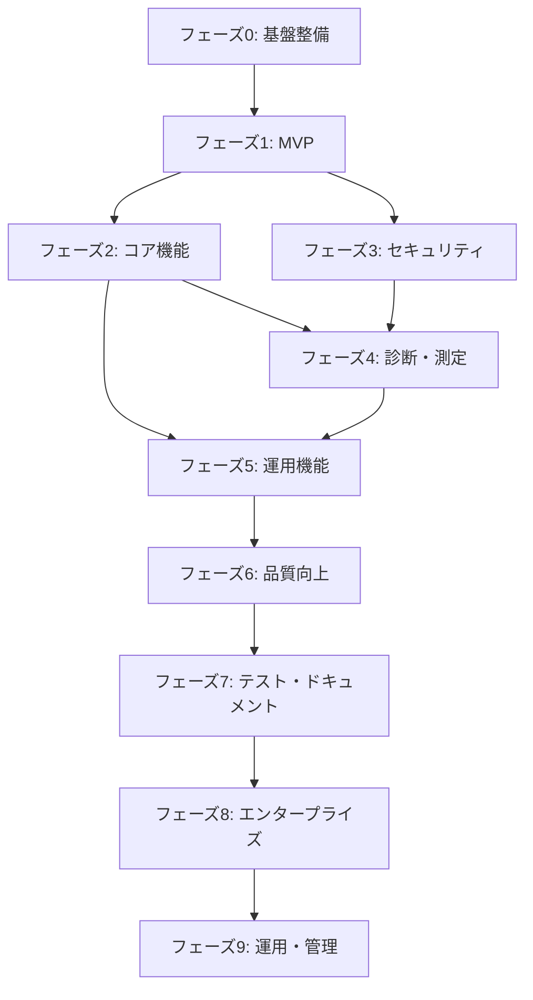

# NeLST 実装計画

DESIGN.mdに基づく段階的な実装計画。

---

## 実装フェーズ概要

| フェーズ | バージョン | 目標 | 期間目安 | 状態 |
|---------|-----------|------|---------|------|
| 0 | v0.0.x | 基盤整備・リファクタリング | 1週間 | ✅ 完了 |
| 1 | v0.1.0 | MVP（最小限の機能） | 2-3週間 | ✅ 完了 |
| 2 | v0.2.0 | コア機能完成 | 2-3週間 | ✅ 完了 |
| 3 | v0.3.0 | セキュリティ機能強化 | 2週間 | ✅ 完了 |
| 4 | v0.4.0 | 診断・測定機能 | 2週間 | ✅ 完了 |
| 5 | v0.5.0 | 運用機能・安定化 | 2週間 | ✅ 完了 |
| 6 | v0.6.0 | 品質向上・機能拡充 | 3週間 | 📋 計画中 |
| 7 | v0.7.0 | テスト・ドキュメント強化 | 2週間 | 📋 計画中 |
| 8 | v1.0.0 | エンタープライズ機能 | 4-6週間 | 📋 計画中 |
| 9 | v1.x | 運用・管理機能 | 4-6週間 | 📋 計画中 |

---

## フェーズ 0: 基盤整備（v0.0.x） ✅

既存コードのリファクタリングと新アーキテクチャへの移行準備。

### 0.1 プロジェクト構造の整理

- [x] 新しいモジュール構造の作成
  ```
  src/
  ├── cli/
  ├── load/
  ├── scan/
  ├── server/
  └── common/
  ```
- [x] 既存の `tcp_client.rs`, `tcp_server.rs` を新構造へ移行
- [x] `initialize/` モジュールを `common/config.rs` へ統合

### 0.2 依存関係の更新

- [x] `Cargo.toml` の依存関係を更新
  ```toml
  [dependencies]
  clap = { version = "4", features = ["derive"] }
  tokio = { version = "1", features = ["full"] }
  mio = { version = "1", features = ["os-poll", "net"] }
  serde = { version = "1", features = ["derive"] }
  serde_json = "1"
  tracing = "0.1"
  tracing-subscriber = "0.3"
  anyhow = "1"
  thiserror = "1"
  indicatif = "0.17"
  chrono = { version = "0.4", features = ["serde"] }
  dirs = "5"
  ```

### 0.3 エラーハンドリング基盤

- [x] `common/error.rs` - カスタムエラー型の定義
- [x] 終了コード（0-5）の実装
- [x] `anyhow` / `thiserror` によるエラー伝播

### 0.4 ロギング基盤

- [x] `log4rs` から `tracing` への移行
- [x] `--verbose` フラグの実装
- [x] ログレベル制御

---

## フェーズ 1: MVP（v0.1.0） ✅

最小限の動作する製品。基本的な負荷テストとTCPスキャンが可能な状態。

### 1.1 CLI基盤

**ファイル**: `src/cli/mod.rs`

- [x] `clap` derive マクロによるCLI定義
- [x] グローバルオプション（`--verbose`, `--json`, `--quiet`）
- [x] サブコマンド構造（load, scan, server, help）

```rust
#[derive(Parser)]
#[command(name = "nelst", version, about)]
struct Cli {
    #[command(subcommand)]
    command: Commands,
    
    #[arg(long, global = true)]
    verbose: bool,
    
    #[arg(long, global = true)]
    json: bool,
}
```

### 1.2 負荷テスト - トラフィック（基本）

**ファイル**: `src/load/traffic.rs`

- [x] TCP送信のみモード（`-m send`）
- [x] エコーモード（`-m echo`）
- [x] 基本オプション
  - `-t, --target`
  - `-d, --duration`
  - `-s, --size`
  - `-c, --concurrency`
- [x] 基本統計（送信数、成功率、レイテンシ）

### 1.3 負荷テスト - コネクション（基本）

**ファイル**: `src/load/connection.rs`

- [x] TCPコネクション確立テスト
- [x] `-n, --count` オプション
- [x] `--timeout` オプション
- [x] 成功/失敗カウント

### 1.4 ポートスキャン（TCP Connect）

**ファイル**: `src/scan/tcp_connect.rs`

- [x] TCP Connectスキャン実装
- [x] ポート範囲指定（`--ports 1-1024`）
- [x] 並列スキャン（`-c, --concurrency`）
- [x] タイムアウト設定
- [x] 結果表示（open/closed/filtered）

### 1.5 テストサーバ（基本）

**ファイル**: `src/server/echo.rs`, `src/server/sink.rs`

- [x] エコーサーバ
- [x] シンクサーバ
- [x] バインドアドレス設定（`-b, --bind`）

### 1.6 出力フォーマット

**ファイル**: `src/common/output.rs`

- [x] テキスト出力（デフォルト）
- [x] JSON出力（`--json`）
- [x] プログレスバー表示（`indicatif`）

### 1.7 MVP完了条件

- [x] `nelst load traffic -t 127.0.0.1:8080 -d 10` が動作
- [x] `nelst load connection -t 127.0.0.1:8080 -n 100` が動作
- [x] `nelst scan port -t 127.0.0.1 --ports 1-1024` が動作
- [x] `nelst server echo -b 0.0.0.0:8080` が動作
- [x] 基本的なエラーハンドリングが機能

---

## フェーズ 2: コア機能完成（v0.2.0） ✅

主要機能の完成とUDP対応。

### 2.1 UDP対応

- [x] `src/load/traffic.rs` - UDP送信モード
- [x] `src/server/echo.rs` - UDPエコーサーバ
- [x] `src/server/sink.rs` - UDPシンクサーバ

### 2.2 HTTP負荷テスト

**ファイル**: `src/load/http.rs`

**依存追加**:
```toml
reqwest = { version = "0.12", default-features = false, features = ["json", "rustls-tls", "http2"] }
```

- [x] GET/POST/PUT/DELETE メソッド
- [x] カスタムヘッダー（`-H`）
- [x] リクエストボディ（`-b`）
- [x] ファイルからボディ読み込み（`-b @file`）
- [x] `--insecure` オプション
- [x] `--follow-redirects` オプション
- [x] HTTP/2サポート（`--http2`）

### 2.3 HTTPテストサーバ

**ファイル**: `src/server/http.rs`

**依存追加**:
```toml
hyper = { version = "1", features = ["full"] }
hyper-util = { version = "0.1", features = ["tokio"] }
http-body-util = "0.1"
rand = "0.8"
```

- [x] 固定レスポンスサーバ
- [x] 遅延シミュレーション（`--delay`）
- [x] エラー率設定（`--error-rate`）

### 2.4 フラッドサーバ

**ファイル**: `src/server/flood.rs`

- [x] 指定サイズのデータを送信し続ける
- [x] TCP/UDP両対応

### 2.5 統計機能強化

**ファイル**: `src/common/stats.rs`

- [x] パーセンタイル計算（P50, P95, P99）
- [ ] ヒストグラム（延期: Phase 4）
- [ ] リアルタイム統計更新（延期: Phase 4）
- [x] 結果のファイル出力（`-o, --output`）

### 2.6 レート制限

- [x] `--rate` オプション実装
- [x] トークンバケットアルゴリズム

### 2.7 バッチモード

- [ ] `--batch <FILE>` オプション（延期: Phase 3）
- [ ] ターゲットファイル読み込み（延期: Phase 3）
- [ ] 順次/並列実行オプション（延期: Phase 3）

---

## フェーズ 3: セキュリティ機能強化（v0.3.0） ✅

高度なスキャン機能の実装。

### 3.1 Raw Socket基盤

**ファイル**: `src/scan/raw_socket.rs`

**依存追加**:
```toml
pnet = "0.35"
socket2 = "0.5"
libc = "0.2"
```

- [x] Raw socket権限チェック（`check_root_privileges()`）
- [x] パケット構築ユーティリティ（`build_tcp_packet()`）
- [x] TCPチェックサム計算（`tcp_checksum()`）
- [x] CAP_NET_RAWの説明・ガイド（エラーメッセージにヒント）

### 3.2 SYNスキャン

**ファイル**: `src/scan/syn.rs`

- [x] SYNパケット構築
- [x] SYN/ACK・RST応答解析
- [x] root権限チェック・エラーメッセージ

### 3.3 その他のスキャン手法

**ファイル**: `src/scan/syn.rs`（共通実装）

- [x] FINスキャン
- [x] Xmasスキャン
- [x] NULLスキャン
- [x] 応答なし=オープンの判定ロジック

### 3.4 UDPスキャン

**ファイル**: `src/scan/udp.rs`

- [x] UDPパケット送信
- [ ] ICMP Port Unreachable検出（延期: Raw Socket必要）
- [x] タイムアウト処理

### 3.5 サービス検出

**ファイル**: `src/scan/service.rs`

- [x] バナー取得（`--grab-banner`）
- [x] サービス識別（SSH, HTTP, SMTP, FTP, MySQL, Redis等）
- [x] バージョン検出（バナーから抽出）
- [ ] サービスデータベース（JSON/TOML）（延期: Phase 4）

### 3.6 SSL/TLS検査

**ファイル**: `src/scan/ssl.rs`

**依存追加**:
```toml
rustls = { version = "0.23", features = ["ring"] }
x509-parser = "0.16"
webpki-roots = "0.26"
tokio-rustls = { version = "0.26", features = ["ring"] }
```

- [x] 証明書情報取得（Subject, Issuer, SAN, 鍵サイズ）
- [x] 有効期限チェック（`days_until_expiry`）
- [x] 対応プロトコル検査（TLSバージョン）
- [x] 暗号スイート検査
- [ ] 既知脆弱性チェック（POODLE, BEAST等）（延期: Phase 4）
- [ ] グレード評価（延期: Phase 4）

### 3.7 スキャン結果比較（diff）

- [ ] `--diff <FILE>` オプション（延期: Phase 4）
- [ ] 新規オープンポート検出（延期: Phase 4）
- [ ] クローズされたポート検出（延期: Phase 4）
- [ ] サービス変更検出（延期: Phase 4）

---

## フェーズ 4: 診断・測定機能（v0.4.0） ✅ 完了

ネットワーク診断と帯域測定。

### 4.0 Phase 2-3 からの延期項目

以下の項目はPhase 2-3で延期され、Phase 5で対応予定：

- [x] ヒストグラム表示（`src/bench/latency.rs`）
- [ ] リアルタイム統計更新（延期: Phase 5）
- [ ] バッチモード（`--batch <FILE>`）（延期: Phase 5）
- [ ] ICMP Port Unreachable検出（UDP scan）（延期: Phase 5）
- [ ] サービスデータベース（JSON/TOML）（延期: Phase 5）
- [ ] SSL/TLS 既知脆弱性チェック（POODLE, BEAST等）（延期: Phase 5）
- [ ] SSL/TLS グレード評価（延期: Phase 5）
- [ ] スキャン結果比較（`--diff <FILE>`）（延期: Phase 5）

### 4.1 Ping ✅

**ファイル**: `src/diag/ping.rs`

**依存追加**:
```toml
surge-ping = "0.8"
```

- [x] ICMP Echo Request/Reply
- [x] TCP ping（ICMP不可時の代替）
- [x] 統計表示（min/max/avg/stddev）
- [x] JSON出力対応

### 4.2 Traceroute ✅

**ファイル**: `src/diag/trace.rs`

- [x] TTL増加によるホップ検出
- [x] UDP/TCP/ICMPモード
- [x] ホップごとのレイテンシ表示
- [x] JSON出力対応

### 4.3 DNS解決 ✅

**ファイル**: `src/diag/dns.rs`

**依存追加**:
```toml
hickory-resolver = "0.25"  # 旧trust-dns-resolver
```

- [x] A/AAAA/MX/TXT/NS/CNAME/SOA/PTR レコード
- [x] カスタムDNSサーバ指定
- [x] TCP/UDP切り替え
- [x] 解決時間測定
- [x] JSON出力対応

### 4.4 MTU探索 ✅

**ファイル**: `src/diag/mtu.rs`

- [x] Path MTU Discovery
- [x] DF（Don't Fragment）フラグ設定（Linux）
- [x] 二分探索による最適MTU検出
- [x] JSON出力対応

### 4.5 帯域幅測定 ✅

**ファイル**: `src/bench/bandwidth.rs`

- [x] 帯域測定サーバ
- [x] 帯域測定クライアント
- [x] Upload/Download/Both測定
- [x] 並列ストリーム対応
- [x] JSON出力対応
- [ ] ジッター計算（延期: Phase 5）

### 4.6 レイテンシ測定 ✅

**ファイル**: `src/bench/latency.rs`

- [x] 継続的なレイテンシ測定
- [x] ヒストグラム表示
- [x] 異常値検出（IQR法）
- [x] JSON出力対応

### 4.7 テストカバレッジ ✅

- [x] diag/ping.rs: 9テスト
- [x] diag/trace.rs: 7テスト
- [x] diag/dns.rs: 13テスト
- [x] diag/mtu.rs: 10テスト
- [x] bench/bandwidth.rs: 5テスト
- [x] bench/latency.rs: 17テスト
- [x] cli/diag.rs: 15テスト
- [x] cli/bench.rs: 11テスト
- [x] 全173テストがパス（Phase 4終了時点）

---

## フェーズ 5: 運用機能・安定化（v0.5.0） ✅

運用に必要な機能と品質向上。

### 5.1 プロファイル管理 ✅

**ファイル**: `src/profile/manager.rs`

- [x] プロファイル保存（`--save-profile`）
- [x] プロファイル読み込み（`--profile`）
- [x] プロファイル一覧/表示/削除
- [x] エクスポート/インポート

### 5.2 設定ファイル ✅

**ファイル**: `src/common/config.rs`

- [x] `~/.nelst/config.toml` 読み込み
- [x] `./nelst.toml` 読み込み（優先）
- [x] CLI引数 > 設定ファイルの優先順位
- [x] `--config` オプション

### 5.3 レポート機能 ✅

**ファイル**: `src/report/formatter.rs`

- [x] JSON出力
- [x] CSV出力
- [x] HTML出力
- [x] Markdown出力
- [ ] 結果比較（`--compare`）（延期: v0.6.0）
- [ ] トレンド分析（`--trend`）（延期: v0.6.0）

### 5.4 ドキュメント ✅

- [x] README.md 更新
- [x] インストール手順
- [x] 使用例（Examples）
- [ ] マニュアルページ（man page）（延期: v0.6.0）
- [x] `--help` メッセージの充実

### 5.5 テスト ✅

- [x] ユニットテスト（各モジュール） - 205テスト
- [ ] 統合テスト（CLIレベル）（延期: v0.6.0）
- [ ] ベンチマークテスト（延期: v0.6.0）
- [x] CI/CD設定（GitHub Actions）

### 5.6 テストカバレッジ（Phase 5追加分） ✅

- [x] cli/mod.rs: 9テスト（+8）
- [x] common/config.rs: 12テスト（+10）
- [x] report/formatter.rs: 22テスト（+14）
- [x] 全205テストがパス（Phase 4: 173 → Phase 5: 205）

### 5.7 パッケージング ✅

- [x] `cargo install` 対応
- [ ] crates.io公開準備（延期: v0.6.0）
- [x] バイナリリリース（Linux/macOS/Windows）
- [ ] Docker イメージ（延期: v0.6.0）

---

## フェーズ 6: 品質向上・機能拡充（v0.6.0） 📋

Phase 2-5で延期された機能の実装と品質向上。

### 6.1 SSL/TLS脆弱性チェック

**ファイル**: `src/scan/ssl.rs`（拡張）

**依存追加**:
```toml
# 既存のrustls/x509-parserで対応可能
```

- [ ] Heartbleed検出（CVE-2014-0160）
- [ ] POODLE検出（CVE-2014-3566）
- [ ] BEAST検出（CVE-2011-3389）
- [ ] CRIME検出（CVE-2012-4929）
- [ ] DROWN検出（CVE-2016-0800）
- [ ] FREAK検出（CVE-2015-0204）
- [ ] Logjam検出（CVE-2015-4000）
- [ ] Sweet32検出（CVE-2016-2183）
- [ ] `--check-vulnerabilities` オプション

### 6.2 SSL/TLSグレード評価

**ファイル**: `src/scan/ssl.rs`（拡張）

- [ ] SSL Labs方式のA-Fグレード算出
- [ ] Protocol Score計算
- [ ] Key Exchange Score計算
- [ ] Cipher Strength Score計算
- [ ] Certificate Score計算
- [ ] `--grade` オプション

### 6.3 スキャン結果比較（diff）

**ファイル**: `src/scan/diff.rs`（新規作成）

- [ ] 2つのスキャン結果の読み込み
- [ ] 新規オープンポート検出
- [ ] クローズされたポート検出
- [ ] サービス変更検出
- [ ] 証明書変更検出
- [ ] `--diff <FILE>` オプション
- [ ] JSON/テキスト差分出力

### 6.4 バッチモード

**ファイル**: `src/common/batch.rs`（新規作成）

- [ ] ターゲットファイル形式の定義
- [ ] コメント行対応（`#`）
- [ ] CIDR表記対応（`10.0.0.0/24`）
- [ ] `--batch <FILE>` オプション
- [ ] `--batch-parallel <NUM>` オプション
- [ ] `--batch-delay <MS>` オプション
- [ ] `--batch-continue-on-error` オプション
- [ ] `--batch-output-dir <DIR>` オプション

### 6.5 リアルタイム統計更新

**ファイル**: `src/common/stats.rs`（拡張）

**依存追加**:
```toml
ratatui = "0.29"
crossterm = "0.28"
```

- [ ] TUI（Terminal User Interface）表示
- [ ] リアルタイムグラフ
- [ ] スループットの経時変化表示
- [ ] レイテンシの経時変化表示
- [ ] `--live` オプション

### 6.6 ジッター計算

**ファイル**: `src/bench/bandwidth.rs`（拡張）

- [ ] パケット到着間隔の測定
- [ ] ジッター（平均偏差）計算
- [ ] 最大ジッター
- [ ] ジッター標準偏差
- [ ] `--jitter` オプション

### 6.7 UDPスキャンICMP検出

**ファイル**: `src/scan/udp.rs`（拡張）

- [ ] Raw socketでのICMPパケット受信
- [ ] ICMP Port Unreachable (Type 3, Code 3) 検出
- [ ] ICMP応答からの送信元ポート抽出
- [ ] タイムアウトとICMP応答の区別

### 6.8 サービスデータベース

**ファイル**: `src/scan/service_db.rs`（新規作成）

- [ ] サービス定義ファイル形式（TOML）
- [ ] `~/.nelst/service-db.toml` 読み込み
- [ ] デフォルトサービスデータベース（組み込み）
- [ ] バナー正規表現マッチング
- [ ] バージョン抽出正規表現
- [ ] プローブ送信定義
- [ ] `nelst service-db update` サブコマンド
- [ ] `nelst service-db add` サブコマンド

### 6.9 レポート比較・トレンド分析

**ファイル**: `src/report/compare.rs`, `src/report/trend.rs`（新規作成）

- [ ] 2結果の比較（`--compare`）
- [ ] 複数結果からのトレンド分析（`--trend`）
- [ ] メトリクス選択（latency, throughput等）
- [ ] トレンドグラフ（テキスト）
- [ ] 劣化/改善の自動判定
- [ ] 推奨事項の生成

### 6.10 完了条件

- [ ] SSL/TLS脆弱性チェック: 8種類以上の脆弱性検出
- [ ] グレード評価が正確に動作
- [ ] バッチモードで100ターゲット以上を処理可能
- [ ] リアルタイム統計がスムーズに表示

---

## フェーズ 7: テスト・ドキュメント強化（v0.7.0） 📋

品質保証とドキュメント整備。

### 7.1 統合テスト

**ファイル**: `tests/` ディレクトリ（新規作成）

- [ ] CLIレベルの統合テスト
- [ ] 負荷テストの E2E テスト
- [ ] ポートスキャンの E2E テスト
- [ ] サーバ起動・停止テスト
- [ ] プロファイル保存・読み込みテスト
- [ ] レポート出力テスト

### 7.2 ベンチマークテスト

**ファイル**: `benches/` ディレクトリ（新規作成）

**依存追加**:
```toml
[dev-dependencies]
criterion = "0.5"
```

- [ ] スループットベンチマーク（req/s）
- [ ] スキャン速度ベンチマーク（ports/s）
- [ ] メモリ使用量計測
- [ ] レイテンシオーバーヘッド計測

### 7.3 マニュアルページ

**依存追加**:
```toml
[build-dependencies]
clap_mangen = "0.2"
```

- [ ] `nelst.1` マニュアルページ生成
- [ ] サブコマンド別マニュアルページ
- [ ] インストールスクリプト
- [ ] `cargo build --features man-pages`

### 7.4 APIドキュメント

- [ ] 全公開APIにドキュメントコメント
- [ ] 使用例の追加
- [ ] `cargo doc` でのドキュメント生成
- [ ] docs.rsへの公開準備

### 7.5 crates.io公開

- [ ] Cargo.toml メタデータ整備
- [ ] LICENSE確認
- [ ] README.md（crates.io向け）
- [ ] CHANGELOG.md作成
- [ ] `cargo publish --dry-run`
- [ ] crates.io公開

### 7.6 Dockerイメージ

**ファイル**: `Dockerfile`, `docker-compose.yml`（新規作成）

- [ ] マルチステージビルド
- [ ] 最小イメージサイズ（< 50MB）
- [ ] セキュリティスキャン（Trivy）
- [ ] Docker Hub公開
- [ ] GitHub Container Registry公開
- [ ] docker-compose.yml（テスト環境用）

### 7.7 完了条件

- [ ] 統合テスト: 主要ユースケース10件以上
- [ ] ベンチマーク: 目標値達成（10,000 req/s, 1,000 ports/s）
- [ ] テストカバレッジ: 70%以上
- [ ] crates.io公開完了

---

## フェーズ 8: エンタープライズ機能（v1.0.0） 📋

大規模環境向けの高度な機能。

### 8.1 分散負荷テスト

**ファイル**: `src/distributed/` ディレクトリ（新規作成）

**依存追加**:
```toml
tonic = "0.12"
prost = "0.13"
```

- [ ] gRPCプロトコル定義（.proto）
- [ ] コーディネーター実装
- [ ] ワーカー実装
- [ ] ワーカー登録・発見
- [ ] タスク分配アルゴリズム
- [ ] 結果集約
- [ ] `nelst distributed coordinator` サブコマンド
- [ ] `nelst distributed worker` サブコマンド
- [ ] `nelst distributed run` サブコマンド

### 8.2 WebSocket負荷テスト

**ファイル**: `src/load/websocket.rs`（新規作成）

**依存追加**:
```toml
tokio-tungstenite = "0.24"
futures-util = "0.3"
```

- [ ] WebSocket接続確立
- [ ] メッセージ送受信
- [ ] 同時接続数制御
- [ ] メッセージレート制御
- [ ] サブプロトコル対応
- [ ] Ping/Pong処理
- [ ] 統計収集（レイテンシ、スループット）
- [ ] `nelst load websocket` サブコマンド

### 8.3 gRPC負荷テスト

**ファイル**: `src/load/grpc.rs`（新規作成）

- [ ] .protoファイル読み込み
- [ ] サーバリフレクション対応
- [ ] Unary RPC テスト
- [ ] Server Streaming テスト
- [ ] Client Streaming テスト
- [ ] Bidirectional Streaming テスト
- [ ] メタデータ設定
- [ ] `nelst load grpc` サブコマンド

### 8.4 リアルタイムメトリクス送信

**ファイル**: `src/metrics/` ディレクトリ（新規作成）

**依存追加**:
```toml
metrics = "0.23"
metrics-exporter-prometheus = "0.15"
influxdb2 = "0.5"
```

- [ ] Prometheusエクスポーター（/metrics）
- [ ] InfluxDB v2 Push
- [ ] StatsD UDP
- [ ] OpenTelemetry Protocol (OTLP)
- [ ] `--metrics-exporter` オプション
- [ ] メトリクス名のカスタマイズ

### 8.5 OS検出

**ファイル**: `src/scan/os_detect.rs`（新規作成）

- [ ] TCPフィンガープリント収集
- [ ] Initial TTL分析
- [ ] Window Size分析
- [ ] TCP Options分析
- [ ] フィンガープリントデータベース
- [ ] 確信度計算
- [ ] `nelst scan os` サブコマンド

### 8.6 スクリプトエンジン

**ファイル**: `src/scripting/` ディレクトリ（新規作成）

**依存追加**:
```toml
rhai = { version = "1.19", features = ["sync"] }
```

- [ ] Rhaiエンジン統合
- [ ] NeLST API のバインディング
- [ ] scan_ports() 関数
- [ ] detect_service() 関数
- [ ] http_load_test() 関数
- [ ] export_json() 関数
- [ ] `nelst script run` サブコマンド
- [ ] サンプルスクリプト作成

### 8.7 プラグインシステム

**ファイル**: `src/plugin/` ディレクトリ（新規作成）

- [ ] プラグインインターフェース定義
- [ ] ネイティブプラグイン（.so/.dll）対応
- [ ] WebAssemblyプラグイン対応
- [ ] プラグイン読み込み・管理
- [ ] ScannerPlugin trait
- [ ] ReporterPlugin trait
- [ ] `nelst plugin list` サブコマンド
- [ ] `nelst plugin install` サブコマンド

### 8.8 完了条件

- [ ] 分散負荷テスト: 5ワーカー以上での動作確認
- [ ] WebSocket: 1,000同時接続の処理
- [ ] gRPC: 主要RPCパターンのサポート
- [ ] メトリクス: Prometheus/Grafanaでの可視化確認

---

## フェーズ 9: 運用・管理機能（v1.x） 📋

運用環境向けの管理機能。

### 9.1 Web UI / ダッシュボード

**ファイル**: `src/web/` ディレクトリ（新規作成）

**依存追加**:
```toml
axum = "0.7"
tower = "0.5"
tower-http = { version = "0.6", features = ["fs", "cors"] }
askama = "0.12"
```

- [ ] REST API設計・実装
- [ ] 静的ファイル配信
- [ ] テスト実行API
- [ ] 結果取得API
- [ ] プロファイル管理API
- [ ] フロントエンド（HTML/CSS/JS）
- [ ] リアルタイム更新（WebSocket）
- [ ] `nelst web` サブコマンド

### 9.2 スケジュール実行

**ファイル**: `src/scheduler/` ディレクトリ（新規作成）

**依存追加**:
```toml
cron = "0.12"
```

- [ ] cron式パーサー
- [ ] スケジュール保存（TOML）
- [ ] デーモンモード
- [ ] タスク実行・ログ記録
- [ ] `nelst scheduler start` サブコマンド
- [ ] `nelst scheduler add` サブコマンド
- [ ] `nelst scheduler list` サブコマンド
- [ ] `nelst scheduler remove` サブコマンド

### 9.3 アラート通知

**ファイル**: `src/notify/` ディレクトリ（新規作成）

- [ ] アラート条件式パーサー
- [ ] Slack Webhook通知
- [ ] Discord Webhook通知
- [ ] Email通知（SMTP）
- [ ] PagerDuty連携
- [ ] カスタムWebhook
- [ ] `--alert-on` オプション
- [ ] `--notify` オプション

### 9.4 マルチターゲット同時テスト

**ファイル**: `src/multi/` ディレクトリ（新規作成）

- [ ] 複数ターゲット同時実行
- [ ] 結果集約・比較
- [ ] ターゲット別統計
- [ ] 集約統計（Aggregate）
- [ ] `nelst multi run` サブコマンド
- [ ] `--target` 複数指定対応

### 9.5 完了条件

- [ ] Web UI: ブラウザからテスト実行・結果確認可能
- [ ] スケジュール: cron式でのテスト自動実行
- [ ] アラート: Slack/Discordへの通知確認
- [ ] マルチターゲット: 10ターゲット同時テスト

---

## タスク依存関係



### クリティカルパス

1. CLI基盤 → 全機能
2. 統計基盤 → 負荷テスト結果表示
3. Raw Socket基盤 → SYN/FIN/Xmas/NULLスキャン
4. 出力フォーマット → レポート機能

---

## 実装優先順位

### 高優先度（Must Have）

1. CLI基盤（clap）
2. TCPトラフィック負荷テスト
3. TCP Connectスキャン
4. エコーサーバ
5. 基本統計
6. JSON出力

### 中優先度（Should Have）

7. HTTP負荷テスト
8. SYNスキャン
9. SSL/TLS検査
10. サービス検出
11. プロファイル管理
12. UDP対応

### 低優先度（Nice to Have）

13. 診断機能（ping/traceroute/DNS）
14. 帯域測定
15. FIN/Xmas/NULLスキャン
16. HTML/Markdownレポート
17. トレンド分析

---

## 品質基準

### コード品質

- [x] `cargo clippy` 警告なし
- [x] `cargo fmt` 適用
- [ ] 全公開APIにドキュメントコメント
- [ ] エラーメッセージは日本語/英語対応可能な設計

### テストカバレッジ

- [ ] ユニットテスト: 70%以上
- [ ] 統合テスト: 主要ユースケースをカバー

### パフォーマンス

- [ ] 10,000 req/s 以上のスループット（負荷テストクライアント）
- [ ] 1,000 ports/s 以上のスキャン速度
- [ ] メモリ使用量 < 100MB（通常使用時）

---

## リスクと対策

| リスク | 影響 | 対策 |
|-------|------|------|
| Raw socket権限 | SYN等のスキャンが動作しない | CAP_NET_RAW設定ガイドを提供 |
| プラットフォーム差異 | macOS/Windows で動作しない | 条件付きコンパイル、CI で複数OS テスト |
| 既存コードとの互換性 | リファクタリングで機能喪失 | 既存テストの移行、E2Eテスト |
| 依存クレートの脆弱性 | セキュリティ問題 | `cargo audit` 定期実行 |
| gRPC/分散システムの複雑性 | v1.0.0の遅延 | プロトタイプ先行、段階的実装 |
| WebAssembly互換性 | プラグインシステムの制限 | ネイティブプラグイン優先、WASI対応 |

---

## 次のアクション

### 完了済み（Phase 0-5）
1. [x] フェーズ0のタスクを開始
2. [x] `Cargo.toml` 依存関係の更新
3. [x] 新しいディレクトリ構造の作成
4. [x] CLI基盤の実装（clap）
5. [x] フェーズ1 MVPの実装
6. [x] フェーズ2 コア機能の実装
7. [x] フェーズ3 セキュリティ機能の実装
8. [x] フェーズ4 診断・測定機能の実装
9. [x] フェーズ5 運用機能・安定化の完了

### Phase 6 開始時のアクション
10. [ ] SSL/TLS脆弱性チェックの設計レビュー
11. [ ] バッチモードのターゲットファイル形式確定
12. [ ] TUI (ratatui) のプロトタイプ作成
13. [ ] サービスデータベース形式の策定

### Phase 7 開始時のアクション
14. [ ] 統合テストフレームワークの選定
15. [ ] benchmarkターゲット値の再評価
16. [ ] crates.io公開前チェックリスト作成

### Phase 8 開始時のアクション
17. [ ] gRPCプロトコル定義の設計
18. [ ] 分散テストアーキテクチャの詳細設計
19. [ ] スクリプトAPI設計

### Phase 9 開始時のアクション
20. [ ] Web UI技術スタック確定（axum + htmx / React等）
21. [ ] アラート条件式の文法定義
22. [ ] スケジューラのデーモン設計
